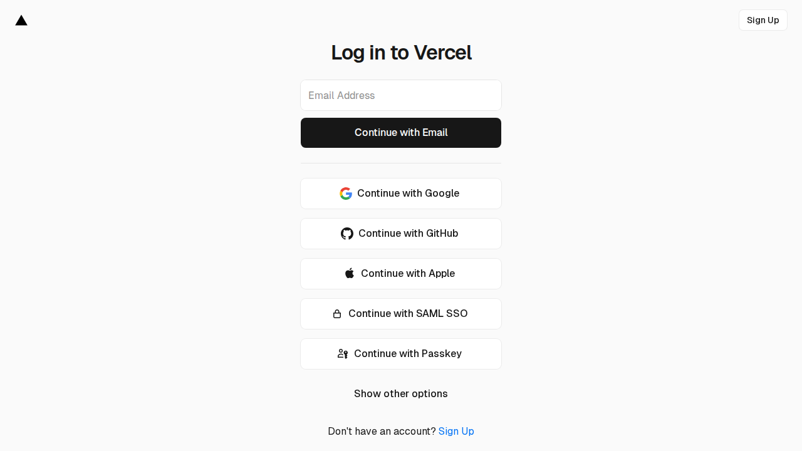

# TimePiece Vault



Premium watch collection tracker with market valuation and service reminders.

**Live Demo**: https://final-15r6x48or-n8garvies-projects.vercel.app

## Environment Configuration

## Required Environment Variables

Create a `.env.local` file in the project root with the following variables:

```bash
# Convex
NEXT_PUBLIC_CONVEX_URL=https://your-deployment.convex.cloud

# Clerk Authentication
NEXT_PUBLIC_CLERK_PUBLISHABLE_KEY=pk_test_...
CLERK_SECRET_KEY=sk_test_...
NEXT_PUBLIC_CLERK_SIGN_IN_URL=/sign-in
NEXT_PUBLIC_CLERK_SIGN_UP_URL=/sign-up
NEXT_PUBLIC_CLERK_AFTER_SIGN_IN_URL=/dashboard
NEXT_PUBLIC_CLERK_AFTER_SIGN_UP_URL=/dashboard
```

## Setup Instructions

### 1. Convex Setup

```bash
# Install Convex CLI globally
npm install -g convex

# Initialize Convex in your project
npx convex dev

# This will:
# - Create a new Convex project (or use existing)
# - Set up the deployment URL
# - Start the Convex dev server
```

### 2. Clerk Setup

1. Go to https://clerk.com and create an account
2. Create a new application
3. Copy the Publishable Key and Secret Key
4. Add them to your `.env.local` file

### 3. Run the Development Server

```bash
npm install
npm run dev
```

The app will be available at http://localhost:3000

## Production Deployment

### Vercel Deployment

1. Push your code to GitHub
2. Connect your repo to Vercel
3. Add the environment variables in Vercel dashboard
4. Deploy!

### Convex Production

```bash
# Deploy Convex functions to production
npx convex deploy
```

## File Structure

```
timepiece-vault/
├── app/                    # Next.js App Router
│   ├── dashboard/          # Dashboard page
│   ├── collection/         # Collection grid page
│   ├── watches/            # Watch detail and form pages
│   ├── layout.tsx          # Root layout
│   ├── page.tsx            # Landing page
│   └── globals.css         # Global styles
├── components/             # React components
│   └── convex-client-provider.tsx
├── convex/                 # Convex backend
│   ├── schema.ts           # Database schema
│   ├── watches.ts          # Watch queries/mutations
│   ├── serviceRecords.ts   # Service record functions
│   ├── marketValues.ts     # Market value functions
│   ├── insurancePolicies.ts # Insurance functions
│   └── userPreferences.ts  # User preferences functions
├── lib/                    # Utilities
│   ├── utils.ts            # Helper functions
│   ├── validations.ts      # Zod schemas
│   └── convex.ts           # Convex client
├── public/                 # Static assets
├── package.json
├── tsconfig.json
├── next.config.js
├── tailwind.config.js
└── .env.local              # Environment variables (not in git)
```

## Features Implemented

### MVP Features
- ✅ Collection grid with search and filter
- ✅ Watch details form with comprehensive fields
- ✅ Market value tracking with price history charts
- ✅ Service calendar with upcoming reminders
- ✅ Photo storage (base64 for MVP, upgrade to proper storage for production)
- ✅ Insurance policy management

### Authentication
- ✅ Clerk integration for secure auth
- ✅ Protected routes

### Database
- ✅ Convex schema with proper indexes
- ✅ Row-level security via ownership checks
- ✅ Real-time sync

## Future Enhancements

- [ ] Proper image storage (Cloudinary/AWS S3)
- [ ] Market price API integration (Chrono24, WatchCharts)
- [ ] Email notifications for service reminders
- [ ] Mobile app (React Native)
- [ ] Social features (private sharing)
- [ ] AI-powered market predictions
- [ ] Watch authentication service integration
- [ ] Multi-currency support with conversion
- [ ] Export collection data (PDF/Excel)
- [ ] Barcode/QR code scanning for watches
